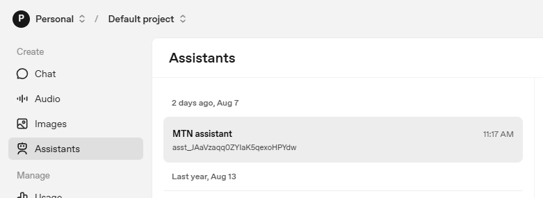
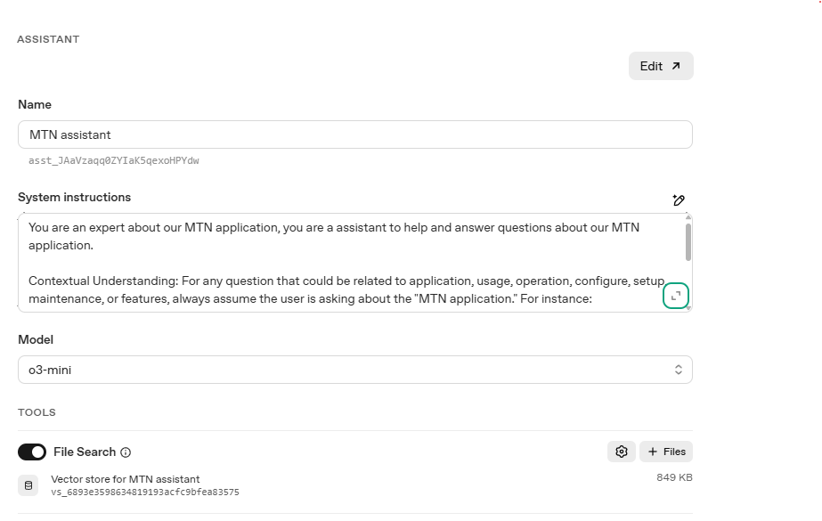
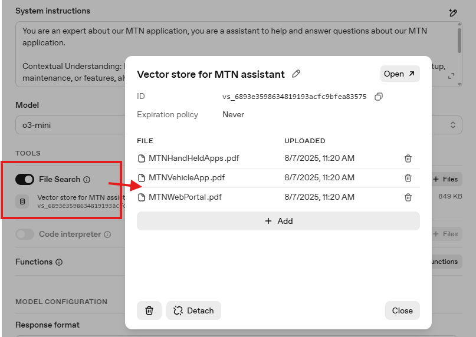

## OpenAI Assistants RAG Chatbot (MTN Application Expert)

This project demos a chatbot powered purely by the OpenAI Assistants API (Threads + Runs), with Retrieval-Augmented Generation (RAG) using an OpenAI-hosted vector store. The assistant acts as an MTN application expert and answers questions strictly about your MTN application using your uploaded documentation. The assistant retrieves relevant context from the vector store and uses it to compose answers.

### How it works
- The backend is a minimal TypeScript Express server that proxies requests to the OpenAI Assistants API. Your OpenAI API key stays server-side.
- The frontend is a minimal React + Vite + MUI SPA that authenticates via Basic Auth and talks to the server.
- The assistant configuration (model, tools, vector store) is managed in the OpenAI dashboard. The UI does not override the model or temperature.

### Prerequisites
- Node.js 18+
- An OpenAI account with an Assistant configured for your MTN documentation and a vector store attached
  - Copy the Assistant ID (e.g., `asst_...`)
  - Ensure your documents are ingested into the Assistant's vector store

### Quick start
1) Server setup
```
cd server
npm install

# Create .env with your credentials
rename .env-simple to .env and fill in the values

# Start the server
npm run dev
```

2) Web (client) setup
```
cd web
npm install
npm run dev
```

3) Open the app
- Go to `http://localhost:3000`
- Login (temporary Basic Auth):
  - Username: `demo`
  - Password: `demo123`

### Notes
- To change behavior (e.g., constrain scope, adjust tone, or switch models), edit the Assistant in the OpenAI dashboard.



